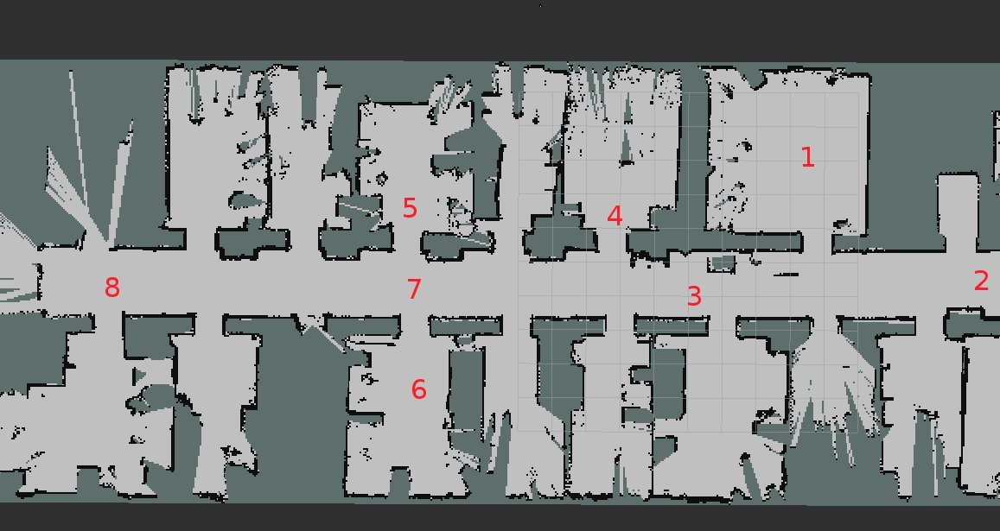
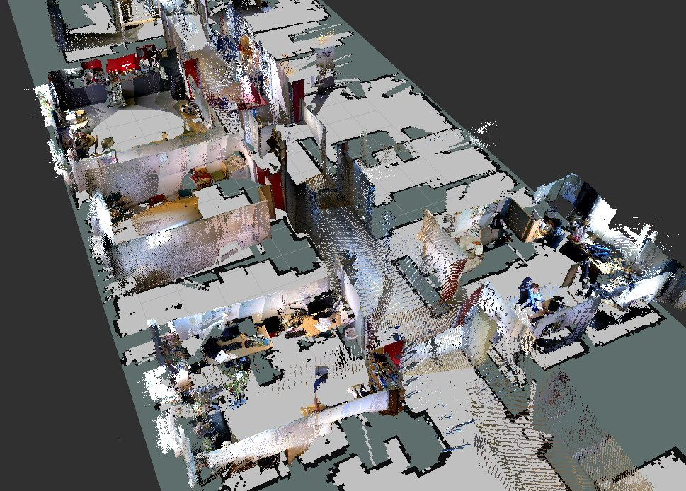

KTH Longterm Dataset
--------------------

KTH Scitos G5 robot - Rosie

The data was collected autonomously by a Scitos G5 robot with an RGB-D camera on a pan-tilt, navigating through the KTH office environment over a period of approximately 30 days. Each observation consists of a set of 51 RGB-D images obtained by moving the pan-tilt in a pattern, in increments of 20 degrees horizontally and 25 vertically. Waypoints are visited between 80 and 100 times and a total of approximately 720 observations are collected at the eight waypoints that can be seen in the figure below. The data is a part of the [Strands](http://strands.acin.tuwien.ac.at/index.html) EU FP7 project.

WayPoint positions on the map

Observations overlayed on the 2D map

### Dataset structure

The [data](https://strands.pdc.kth.se/public/KTH_longterm_dataset_registered) is structured in folders as follows: *YYYYMMDD/patrol\_run\_YYY/room\_ZZZ*, where:

-   **YYYYMMDD** represents the year, month & day when those particular observations were acquired. Each such folder contains the patrol runs the robot collected on that specific date.
-   **patrol\_run\_YYY** represents one of the patrol runs collected by the robot.
-   **room\_ZZZ** represents a particular observation collected during a patrol run.

Each folder of the type *YYYMMDD/patrol\_run\_YYY/room\_ZZZ* contains the following files:

-   **room.xml** - contains information relevant for the observation (described in the next section)
-   **complete\_cloud.pcd** - the point cloud of the observation (obtained by merging the individual point clouds together)
-   **intermediate\_cloud\*.pcd** - ordered point clouds, each corresponding to an RGB and depth image acquired by the camera while conducting the sweep (51 such point clouds for each observation)

The *room.xml* file accompanying an observation contains the following (relevant) fields:

**RoomLogName** - identifier which associates the observation with the folder structure

**RoomRunNumber** - identifier which denotes when the observation was acquired during the patrol run (i.e. 0 - first, 1 - second, etc.)

**RoomStringId** - identifier which corresponds to the waypoint at which the observation was acquired.

**RoomLogStartTime / RoomLogEndTime** - acquisition time

**Centroid** - observation centroid in the map frame

**RoomCompleteCloud** - complete cloud filename

**RoomIntermediateClouds**

**RoomIntermediateCloud** - intermediate cloud filename

-   **RoomIntermediateCloudTransform** - transform from the RGB-D sensor frame to the map frame, as given by the robot odometry
-   **RoomIntermediateCloudTransformRegistered** - transform which corrects the pose of the intermediate clouds so that they are well registered with respect to each other

### Parsing

A parser is provided [here](https://github.com/strands-project/strands_3d_mapping/tree/hydro-devel/metaroom_xml_parser) (can be installed with ` sudo apt-get install ros-indigo-metaroom-xml-parser`) which reads in the data and returns C++ data structures encapsulating the low-level data from the disk. Form more information please refer to [the parser README](https://github.com/strands-project/strands_3d_mapping/tree/hydro-devel/metaroom_xml_parser) ( or [here](https://github.com/strands-project/strands_3d_mapping/blob/hydro-devel/metaroom_xml_parser/include/metaroom_xml_parser/load_utilities.h) for a list of supported methods). Information about how to use the Strands package repository can be found [here](https://github.com/strands-project-releases/strands-releases/wiki).

### Download

This dataset is available for download in a single archive [file](https://strands.pdc.kth.se/public/KTH_longterm_dataset_registered.tar.gz) (\~ 300 GB). As an alternative, the individual folders and files can be obtained from [here](https://strands.pdc.kth.se/public/KTH_longterm_dataset_registered), and would have to be downloaded manually.

* * * * *

### Condition of use

If you use the dataset for your research, please cite our [paper](https://strands.pdc.kth.se/public/KTH_longterm_dataset_registered/ambrus2015unsupervised.pdf) that describes it:

        
        Unsupervised learning of spatial-temporal models of objects in a long-term autonomy scenario 
        Ambrus, Rares and Ekekrantz, Johan and Folkesson, John and Jensfelt, Patric
        Intelligent Robots and Systems (IROS), 2015 IEEE/RSJ International Conference on
        
        

We attached a [bibtex](https://strands.pdc.kth.se/public/KTH_longterm_dataset_registered/ambrus2015unsupervised.bib) record for your convenience.
