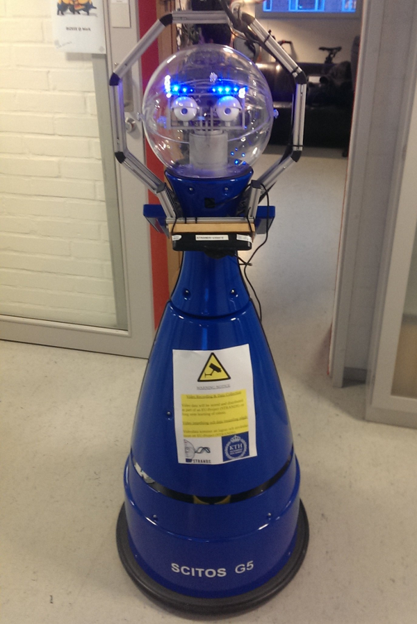
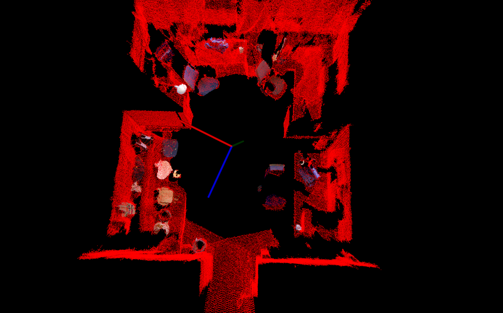

KTH Moving Objects Dataset
--------------------------

KTH Scitos G5 robot - Rosie

This dataset extends [KTH Longterm Dataset Labels](https://strands.pdc.kth.se/public/KTH_longterm_dataset_labels/readme.html) with more locations within the same office environment at KTH. The dataset contains a subset of the labels and these objects are consistently located in different positions in multiple rooms. The label subset annotated in this dataset is {*chair6*, *chair1*, *water\_boiler*, *backpack1*, *pillow*, *trash\_bin*, *backpack3*, *chair2*, *hanger\_jacket*, *backpack2*}. Each observation consists of a set of 17 RGB-D images obtained by moving the pan-tilt in a horizontal pattern, in increments of 20 degrees. In addition to the raw sensor data, each observation contains object annotations (masks and labels). The data is a part of the [Strands](http://strands.acin.tuwien.ac.at/index.html) EU FP7 project.

### Dataset structure

The [data](https://strands.pdc.kth.se/public/KTH_longterm_dataset_labels) is structured in folders as follows: *YYYYMMDD/patrol\_run\_YYY/room\_ZZZ*, where:

-   **YYYYMMDD** represents the year, month & day when those particular observations were acquired. Each such folder contains the patrol runs the robot collected on that specific date.
-   **patrol\_run\_YYY** represents one of the patrol runs collected by the robot.
-   **room\_ZZZ** represents a particular observation collected during a patrol run.

Each folder of the type *YYYMMDD/patrol\_run\_YYY/room\_ZZZ* contains the following files:

-   **room.xml** - contains information relevant for the observation (described in the next section)
-   **surfel\_map.pcd** - the surfel map constructed by using the data fusion component of [Elastic Fusion](https://github.com/mp3guy/ElasticFusion)
-   **complete\_cloud.pcd** - the point cloud of the observation (obtained by thresholding the confidence of surfel\_map.pcd at 0.3)
-   **intermediate\_cloudXXXX.pcd** - ordered point clouds, each corresponding to an RGB and depth image acquired by the camera while conducting the sweep (17 such point clouds for each observation, with **XXXX** going from 0000 to 0016)
-   **rgb\_XXXX.jpg** - RGB image generated from the corresponding **intermediate\_cloudXXXX.pcd**
-   **depth\_XXXX.png** - depth image generated from the corresponding **intermediate\_cloudXXXX.pcd**
-   **rgb\_XXXX\_label\_\#.jpg** - binary mask corresponding to one of the objects annotated in the image **rgb\_XXXX.jpg**
-   **rgb\_XXXX\_label\_\#.pcd** - point cloud generated from object mask **rgb\_XXXX\_label\_\#.jpg**
-   **rgb\_XXXX\_label\_\#.txt** - object label corresponding to annotation **rgb\_XXXX\_label\_\#.jpg**
-   **rgb\_XXXX\_label\_\#.xml** - xml file storing the labelled object data (created with data from **rgb\_XXXX\_label\_\#.pcd**, **rgb\_XXXX\_label\_\#.txt**)
-   **rgb\_XXXX\_object\_\#.jpg** - rgb mask corresponding to one of the objects annotated in the image **rgb\_XXXX.jpg**

The description of the *room.xml* file accompanying an observation can be found [here](https://strands.pdc.kth.se/public/KTH_longterm_dataset_registered/readme.html). \
\
 Each object xml file (**rgb\_XXXX\_label\_\#.xml**) contains the following data:

-   **label** - object label
-   **filename** - object pcd file
-   **Centroid** - object centroid, in the map frame
-   **LogTime** - time when the object was observed

### Parsing

A parser is provided [here](https://github.com/strands-project/strands_3d_mapping/tree/hydro-devel/metaroom_xml_parser) (can be installed with ` sudo apt-get install ros-indigo-metaroom-xml-parser`) which reads in the data and returns C++ data structures encapsulating the low-level data from the disk. Form more information please refer to [the parser README](https://github.com/strands-project/strands_3d_mapping/tree/hydro-devel/metaroom_xml_parser) ( or [here](https://github.com/strands-project/strands_3d_mapping/blob/hydro-devel/metaroom_xml_parser/include/metaroom_xml_parser/load_utilities.h) for a list of supported methods). Information about how to use the Strands package repository can be found [here](https://github.com/strands-project-releases/strands-releases/wiki). \
\
 Assuming [the parser](https://github.com/strands-project/strands_3d_mapping/tree/hydro-devel/metaroom_xml_parser) has been installed, the labelled data can be visualized with the following sample application: \
\
 ` rosrun metaroom_xml_parser load_labelled_data /path/to/data WayPoint10 ` \
\
 This loads all the observations along with the labelled data from the path specified and displays each observation along with the corresponding labelled objects in a visualizer window.

  -------------------------------- -------------------------------- --------------------------------
        
  -------------------------------- -------------------------------- --------------------------------

Observation (red) with labelled objects (RGB)

### Labelling

For more information on the labelling tool used, please refer to [this page](https://github.com/RaresAmbrus/strands_3d_mapping/tree/metric_map_labelling/labelling).

### Download

This dataset is available for download in a single archive [file](https://strands.pdc.kth.se/public/KTH_labelled_moving_objects.tar.gz) (\~ 6 GB). As an alternative, the individual folders and files can be obtained from [here](https://strands.pdc.kth.se/public/KTH_labelled_moving_objects), and would have to be downloaded manually.

* * * * *

### Contact

[Nils Bore](mailto:nbore@kth.se)\
 [http://www.csc.kth.se/\~nbore/](http://www.csc.kth.se/~nbore/)\
 CSC/CVAP\
 KTH\
 SE-100 44 Stockholm\
 Sweden
