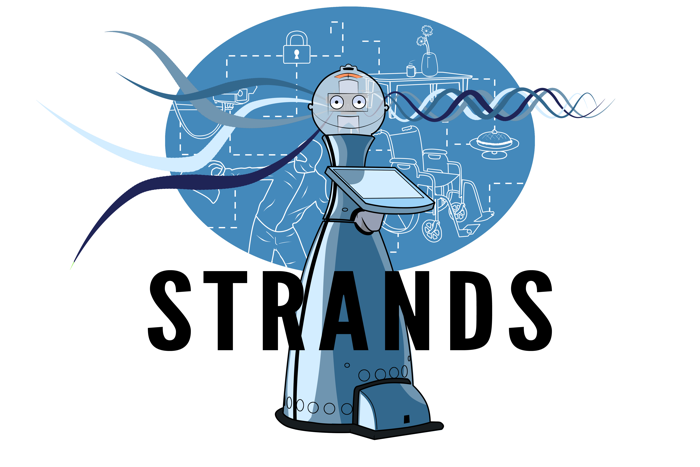

This site contains the documentation for the software and data produced by the [EU STRANDS Project](http://strands-project.eu). For more information on the scientific aims of the project, please see our [IEEE RAM overview article](https://arxiv.org/abs/1604.04384) or [the STRANDS Project website](http://strands-project.eu).

The project created autonomous mobile robots which were successfully deployed for long periods in real user environments. In the process of this we created a great deal of open source software for AI and robotics applications. This software is all available via [the STRANDS GitHub organisation][https://github.com/strands-project]. This site provides a single location where the documentation from across that organisation can be viewed. It is also the main location for software tutorials and guides for creating systems, and provides an entry point into using our software for new users. 

Please note that a large amount of this site is automatically generated from our code and package documentation, so the structure is currently not perfect. Our scripts for automatically generating this site are available [here](https://github.com/strands-project/strands_documentation).

# Getting Started

If you wish to understand or reuse the full STRANDS system, you should follow [the STRANDS system tutorial](setup.md). After completing this tutorial, you will have a computer which has ROS and STRANDS packages installed, and can run a simulation which uses some of the core STRANDS subsystems.

# Core Subsystems

A STRANDS system is formed of many components which provide various pieces of functionality, ranging from navigation to user interaction. A list of all packages with a brief overview of their purpose can be found [here](packages.md). The following sections give a brief overview of some of the packages which form the core of the system.

## STRANDS Navigation

Navigation forms the core of the movement capabilities of robots using the system. Our work provides a [monitored navigation](strands_navigation/monitored_navigation/) system which detects failures in navigation and triggers recovery behaviours, and a [topological navigation](strands_navigation/topological_navigation/) system where navigation nodes (waypoints) are linked by edges which the robot can traverse. Topological navigation underpins many of the other STRANDS capabilities.

## STRANDS Executive

The STRANDS executive controls the execution of tasks requested by users or generated by the system itself, prioritising them using various metrics such as expected completion time, probability of successful completion, and so on. It provides facilities for both long-term task routines, task scheduling and task planning under uncertainty. There is a [STRANDS Executive tutorial](planning_tutorial) which covers the main parts of the system and [an overview document](strands_executive).

## Person Detection and Tracking

When operating in populated spaces it is crucial to be able to detect and track people. STRANDS produced an indoor [multi-person tracker](strands_perception_people/perception_people_launch/) which fuses and tracks upper body detections and leg detections. We also have produced [a wheelchair and walking aid detector](strands_perception_people/wheelchair_detector). 

## 3D Mapping and Vision

One of the major outputs of the project is a collection of systems for discovering and learning about objects in everyday environments. These are collected together into the STRANDS 3D Mapping collection, described [here](strands_3d_mapping).

## Semantic Object Maps (SOMa)

The outputs of person detection and 3D mapping are stored in our Semantic Object Map (SOMa) which captures the information the robot gathers over long durations in a central store which supports a range of visualisations and queries. This is described [here](soma).

## Long-Term Data Processing (FreMEn and QSRLib)

After data is collected in SOMa our systems process it using various techniques. Major outputs of STRANDS include [FreMen](fremen) which provides frequency-based modelling for the temporal dimension of spatial representations, and [QSRLib](http://qsrlib.readthedocs.io/en/latest/), a library for generating qualitative spatial relations from sensor data.

# Datasets

You can find the datasets generated by the project [here](datasets).
